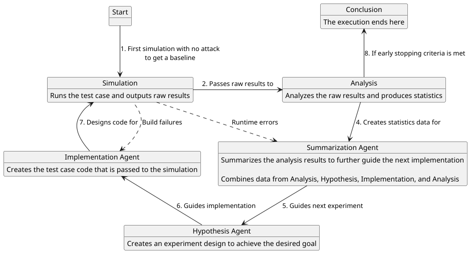

# MicroSampler Automation

This subfolder for MicroSampler looks at adding LLM agents into the loop of side-channel analysis using the MicroSampler pipeline. The current implementation sets up a toy example that uses a series of LLM agents to expose timing leakage in a series of constant-time copy examples. The way that the loop works is like this:



## Setup

Install the Python dependencies with:

```bash
pip install -r requirements.txt
```

Then run the default ccopy example with:

```bash
python governor.py --configs config/ccopy_v3.json
```

The built-in defaults live in `config.py`. JSON config files are cascading overrides, so an experiment config only needs to define the fields that differ from the defaults.

## Important Components

### Cascading Config Files

Configuration is defined with Pydantic models in `config.py` and loaded through `parse_configs`. The root model is `BaseConfig`, which contains the harness, interpreter, LLM, agent, logging, and final report settings. Each JSON config file is validated against that schema, and later config files override earlier/default values.

This gives collaborators two useful extension points:

1. Use JSON to override existing config fields for a specific experiment.
2. Add new Pydantic config classes when a new module needs structured settings.

For example, a custom experiment module can define its own config shape and attach it to `BaseConfig`:

```python
from pathlib import Path
from pydantic import BaseModel


class MyExperimentConfig(BaseModel):
    dataset_prefix: Path
    max_trials: int = 100
    enable_extra_checks: bool = False


class BaseConfig(BaseModel):
    # existing fields...
    my_experiment: MyExperimentConfig = MyExperimentConfig(
        dataset_prefix=Path("experiments/data")
    )
```

Once the field is part of `BaseConfig`, an override file can set it:

```json
{
  "my_experiment": {
    "dataset_prefix": "experiments/ccopy_v4/data",
    "max_trials": 500
  }
}
```

Code that receives the config object can then use `ctx.my_experiment.max_trials` instead of manually parsing dictionaries. This is the preferred pattern for reusable modules because it keeps config validation close to the interface that consumes it.

### Governor

`governor.py` is the orchestration entrypoint. It builds the report log, template controller, deployment controller, and agents, then runs a queued state machine using QSM.

Each state owns one unit of work. Agent states render a prompt, call an LLM-backed `Agent`, store the structured response, log an event, and append the next state name to the queue. Non-agent states run simulation, generate statistics, or conclude the run. Shared run data lives in `GovernorContext`, so states communicate by updating the context rather than passing large argument lists through every call.

The diagram above shows the current flow. The state map is currently wired in Python, but this is expected to evolve; a future version may load the state machine from YAML. Treat the current Python state-map wiring as the active implementation, not a permanent public API.

### Deployments

Deployment modules are responsible for turning generated code into timing results. The common interface is `DeploymentController` in `simulation/api/common.py`:

```python
class DeploymentController(ABC):
    @abstractmethod
    def deploy_test_case(self, code: str, **kwargs) -> pd.DataFrame:
        pass
```

The governor calls `deploy_test_case` from the simulation state. For the ccopy examples, `CCopyDeploymentController` validates and writes the generated `attack.c`, builds the harness, runs the configured number of harness processes, parses the JSON timing output, and returns a dataframe.

The ccopy harness also emits compiler assembly for the deployed attack. The `attack.o` Makefile rule compiles `build/attack.s` with the same `CFLAGS` and `CPPFLAGS` used for `attack.o`, plus assembly-only flags. During deployment, `deploy_harness` copies that file to `ctx.harness.deployment_prefix / ctx.harness.assembly_file`, beside the deployed harness executable. This gives later agent states a stable read-only view of the generated attack assembly for the same build that was run.

The statistics pipeline expects timing data with columns like:

```text
run_name, random_seed, global_iteration, inner_iteration, bit, class, key, duration
```

To support a new target or benchmark style, create a new `DeploymentController` subclass that accepts the generated source code, performs whatever build/deploy/run steps are needed, and returns a dataframe with the columns your analysis code expects. Then wire that controller into `governor.py` in place of `CCopyDeploymentController`.

The lower-level helpers in `simulation/building.py` and `simulation/utils.py` are reusable when the target follows the same pattern: write an attack source file, run `make`, execute a harness binary, and parse stdout.

A future version may also migrate this implementation to a state machine along with a YAML loading implementation, treat the current Python class heirarchy as the active implementation not a permanent public API.

### Prompt Templates

Prompt templates are rendered by `TemplateController` in `prompting/templates.py`. A template can include tags using either:

```text
[[tag]]
[[tag:arg1:arg2]]
```

Tags are registered with `create_template_tool`. A tag handler receives the config object, the controller, the tag name, parsed arguments, and optional runtime keyword arguments:

```python
def insert_run_name(ctx, client, tag_name, args, kwargs):
    return ctx.final_report.run_name


template_controller.create_template_tool("run_name", insert_run_name)
```

The template:

```text
Current run: [[run_name]]
```

will render with the value returned by the handler.

The default project tags are registered in `templates.py`:

- `[[source:path]]`: inserts a source file inside a fenced code block.
- `[[config:key:path]]`: inserts a value from the config object.
- `[[allowed_references]]`: lists local headers the generated attack may include.
- `[[runtime_data:key]]`: inserts runtime data passed into `process_template`.
- `[[model:hypothesis]]`, `[[model:implementation]]`, `[[model:summary]]`: describes a structured Pydantic output model.
- `[[hypothesis]]`: formats the current hypothesis and run configuration.
- `[[sim_feedback]]`: formats build/runtime feedback, or `None`.
- `[[results]]`: formats compact statistical results for summarization.
- `[[summary]]`: formats the previous summarization for the next hypothesis step.

System prompts are rendered when agents are created. Input prompts are rendered each time a state calls an agent, so they can use runtime values from `GovernorContext`, such as the current hypothesis, implementation, statistics, or previous summary.

### Agents

`prompting/client.py` defines the `Agent` wrapper around LangChain's `create_agent` and `ChatOpenAI`. Each agent has:

- A model name from config.
- A rendered system prompt.
- A set of prompt template paths.
- Optional runtime tools selected by config.
- A Pydantic response model used as the structured output format.
- Its own LangGraph checkpoint thread.
- Optional context compaction controlled by `ctx.llm.context_compaction`.

The current response models live in `agents/responses.py`:

- `Hypothesis`: describes the next implementation-guiding strategy and run configuration.
- `Implementation`: contains the generated `attack.c` source and a summary of changes.
- `Summarization`: interprets a completed or failed simulation and gives guidance for the next hypothesis.

To define a new agent, add a new Pydantic response model first:

```python
class Review(BaseModel):
    finding: str
    recommendation: str
```

Then create prompt templates for it, add a config entry with its model, template paths, and optional runtime tools, and instantiate it with `create_agent_from_config`:

```python
review_agent = create_agent_from_config(
    ctx,
    template_controller,
    "review",
    Review,
    dry,
)
```

In normal use, the new agent also needs a state that renders its input prompt, calls `agent.prompt_model`, stores the structured response in `GovernorContext`, logs a report event, and appends the next state to the queue. This keeps the agent interface reusable while letting the state machine decide when and why the agent runs.

Model choice and prompt paths are config-driven, so collaborators can iterate on prompt engineering without rewriting the agent wrapper.

Runtime tools are separate from prompt-template tags. Prompt-template tags run before a prompt is sent and are registered on `TemplateController`. Runtime tools are LangChain tools passed to `create_agent`, so the model may call them during its turn. Tool names are configured per agent with `AgentConfig.tools`, resolved through `prompting.tools.AgentToolRegistry`, and unknown tool names fail during agent construction.

The default summarization agent is configured with `read_attack_assembly`. That tool reads only the deployed `attack.s` path from config and raises `MissingAttackAssemblyError` if the file is absent. It does not run `make`, spawn subprocesses, or accept model-supplied file paths.

### Reports

Reports are generated from an event transcript. The transcript is the ordered list of `ReportEvent` objects recorded during the governor run. Instead of having each section collect its own data while the loop runs, states log structured events, and report sections later decide how to render those events.

This makes the report system reusable in two ways:

1. New states or modules can add new event types without changing every report section.
2. New report sections can interpret the same transcript differently.

The base event type is defined in `reporting/events.py`:

```python
class ReportEvent:
    def __init__(self, iteration, state, kind, payload):
        self.iteration = iteration
        self.state = state
        self.kind = kind
        self.timestamp = datetime.now(tz=timezone.utc)
        self.payload = payload
```

Default event subclasses in `reporting/default/events.py` represent hypothesis outputs, implementations, build errors, simulation errors, analysis results, summaries, and final conclusions. To add a new event, subclass `ReportEvent` and choose:

- `iteration`: which governor iteration produced the event.
- `state`: which state produced it.
- `kind`: a short event category, such as `output`, `error`, or `deployment`.
- `payload`: the structured object, exception, dataframe, or metadata the report should render.

Report sections subclass `ReportSection` from `reporting/sections.py` and implement `body(ctx, events)`. The base class wraps the body in a collapsible HTML `<details>` section and renders Markdown with table and fenced-code support:

```python
class MySection(ReportSection):
    def __init__(self):
        super().__init__(index=2, name="My Section")

    def body(self, ctx, events):
        interesting = [e for e in events if e.kind == "output"]
        return f"Found {len(interesting)} output events."
```

Register sections with `ReportLog.add_section`. Sections are sorted by `index` before rendering.

The default report contains a timeline section and a final verification section. The timeline renders the transcript iteration by iteration, while final verification finds the latest conclusion or analysis event and renders the final scores, hypothesis, implementation, and statistics.

For tables, use `MarkdownTableBuilder` from `reporting/tables.py`. It can render Markdown tables or styled HTML tables, which helps keep report tables readable inside the generated HTML.
